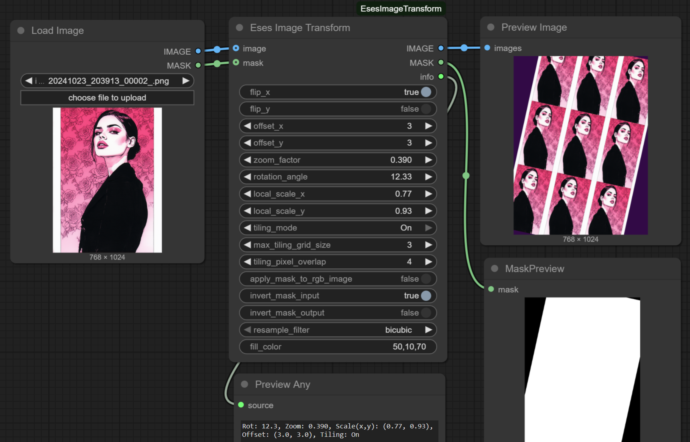

# Eses Image Transform




> [!CAUTION]
> Before downloading and using the contents of this repository, please review the LICENSE.txt and the disclaimer.
> I kindly ask that you respect the licensing terms and the effort put into these tools to ensure their 
> continued availability for everyone. Thank you!


## Description

The 'Eses Image Transform' node offers tools for applying 2D transformations to images and optional masks within ComfyUI. It allows for adjustments to position, scale, and rotation of the input content.

Key features include core transformations like rotation, zoom, offset, and flip, along with tiling and fill options for managing canvas areas exposed by transformations. It also provides masking controls, allowing to apply masks to RGB images and invert mask inputs or outputs. It is also possible to select resampling filters for scaling and rotation.

❓ I wanted to create this node as a single tool that does most (if not all) of the common image transformations. Think of it as turning your image into a card that can be moved, rotated, and scaled inside its frame. I didn't find any similar tools as a separate install (I don't like node packs) for ComfyUI, so that's why I created this.

💡 This node relies on the Pillow (PIL) library for image processing (= no need to install any dependencies).

💡 It performs all operations on the CPU.


## Features

* **Core Transformations**:
    * **Rotation**: Rotates the image around its center.
    * **Zoom**: Scales the image in or out from the center.
    * **Offset**: Shifts the image horizontally and vertically.
    * **Flip**: Flips the image on its X or Y axis.
    * **Local Scale**: Squashes or stretches the image along its local X or Y axis.

* **Tiling and Fill**:
    * **Tiling**: Fills the canvas with repeating copies of the source image when zoomed out.
    * **Fill Color**: Sets the background color for areas exposed by transformations. Supports RGB (e.g., 255,128,0) or RGBA (e.g., 0,255,0,128) values.

* **Masking Controls**:
    * **Apply Mask to RGB Image**: Uses the mask to define the transparency of the output image.
    * **Invert Mask Input**: Inverts the incoming mask before transformations are applied.
    * **Invert Mask Output**: Inverts the final generated mask before it is output.

* **Quality**:
    * **Resampling Filter**: Sets the algorithm (e.g., bicubic, nearest neighbor) used for scaling and rotation operations.


## Requirements

* PyTorch – (you should have this if you have ComfyUI installed).
* Pillow (PIL) - (you should have this if you have ComfyUI installed).


## Installation

1.  **Navigate to your ComfyUI custom nodes directory:**
    ```
    ComfyUI/custom_nodes/
    ```

2.  **Clone this repository:**
    ```
    git clone https://github.com/quasiblob/ComfyUI-EsesImageTransform.git
    ```

3.  **Restart ComfyUI:**
    * After restarting, the "Eses Image Transform" node will be available in the "Eses Nodes/Image" category.


## Folder Structure
```
ComfyUI-EsesImageLoader/
├── init.py                     # Main module defining the custom node.
├── image_transform.py          # The Python file containing the node logic.
├── README.md                   # This file.
└── LICENSE.txt                 # Please read this file before using this node.
```


## Usage

* Connect an image and an optional mask to the node's inputs. 
* Adjust the transformation parameters as needed using the node's controls. 
* The node will output the transformed image and mask.


## Inputs

*


## Outputs

* **IMAGE** (`IMAGE`): The transformed image as an RGB or RGBA tensor.
* **MASK** (`MASK`): The corresponding transformed mask tensor.
* **INFO** (`STRING`): A string providing summary information about the applied transformations.


## Category

Eses Nodes/Image


## Contributing

* Feel free to report bugs and improvement ideas in issues, but I may not have time to do anything.


## License

* See LICENSE.txt


## About

-


## Update History

* 2025.7.2 Version 1.1.0 add local scale support

* 2025.7.2 Version 1.0.2 minor code comments cleanup

* 2025.7.1 Version 1.0.1 code comments cleanup

* 2025.6.26 Version 1.0.0 released


## ⚠️Disclaimer⚠️

This custom node for ComfyUI is provided "as is," without warranty of any kind, express or implied. By using this node, you agree that you are solely responsible for any outcomes or issues that may arise. Use at your own risk.


## Acknowledgements

Thanks to the ComfyUI team and community for their ongoing work!
